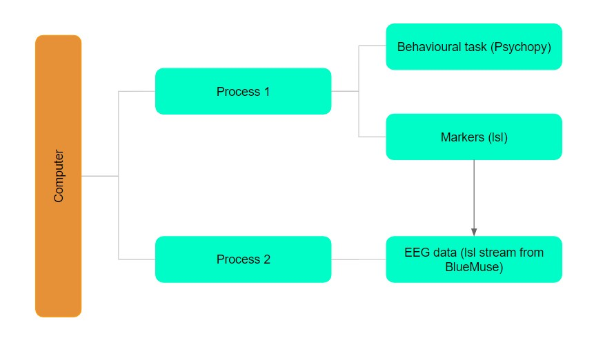

# Dawsonmuse

A module for running EEG experiments with Psychopy and a Muse device.

## Requirements

The code has only been tested on Windows and relies on BlueMuse to get a stream from a Muse device. 

compatible with python 3.6

## Installation

Once in a virtual environment, you can run these commands to download the repository.

     git clone https://github.com/raharison-toky/dawsonmuse
     cd dawsonmuse
     pip install -e .

## Instructions

This module was designed for students without programming experience so an in-depth beginner's guide is available as a [pdf](https://drive.google.com/file/d/1klmqJFyxAPQZ_7WkVIpYJU1wy7ZAXSwh/view?usp=sharing).

## How it works

The code does get the data directly from the Muse, it instead gets an lsl-stream from BlueMuse (or theoretically another software). This is why BlueMuse is required; therefore, compatibility with MacOS would rely on another software to establish a connection between the computer and a Muse device. Recording EEG data while running a Psychopy experiment is then possible by using multiprocessing. 

